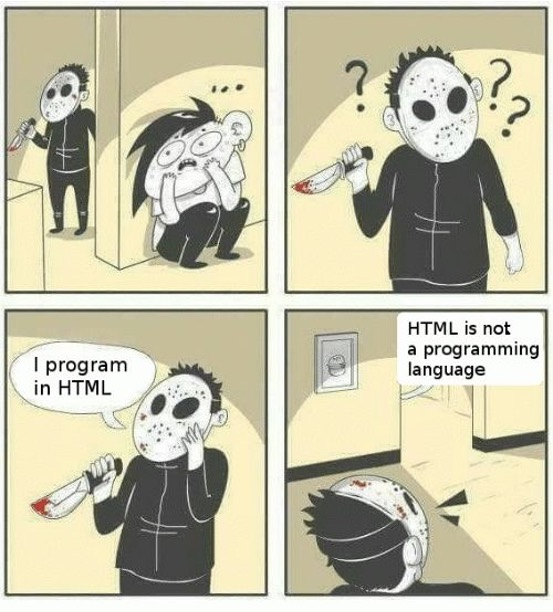

# node.html

## concept
html is not programming language

Until when the hell do we have to stop html from being a programming language?

#### From now on, HTML is a programming language. This project is HTML

## syntax
&lt;div&gt;태그는 블럭 단위로 사용됩니다.
